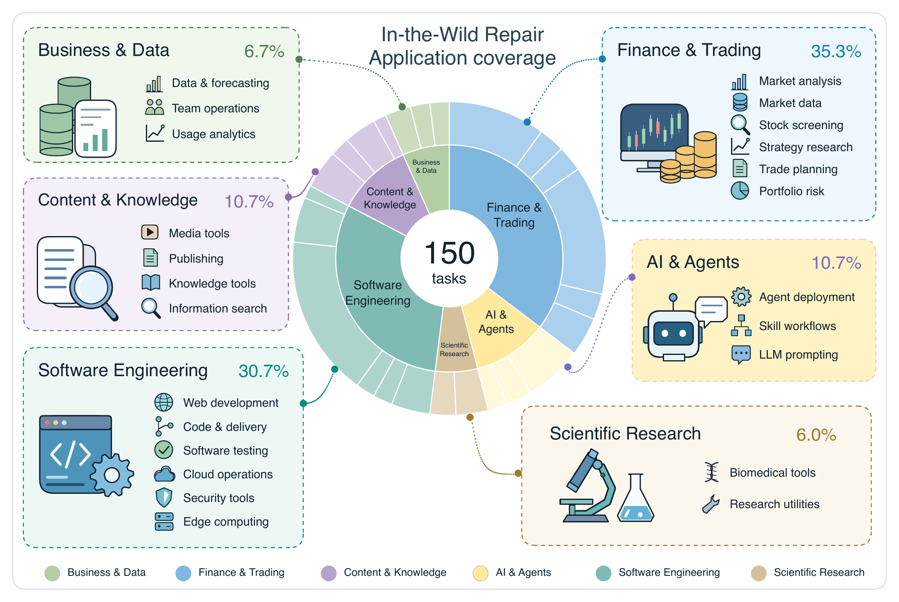
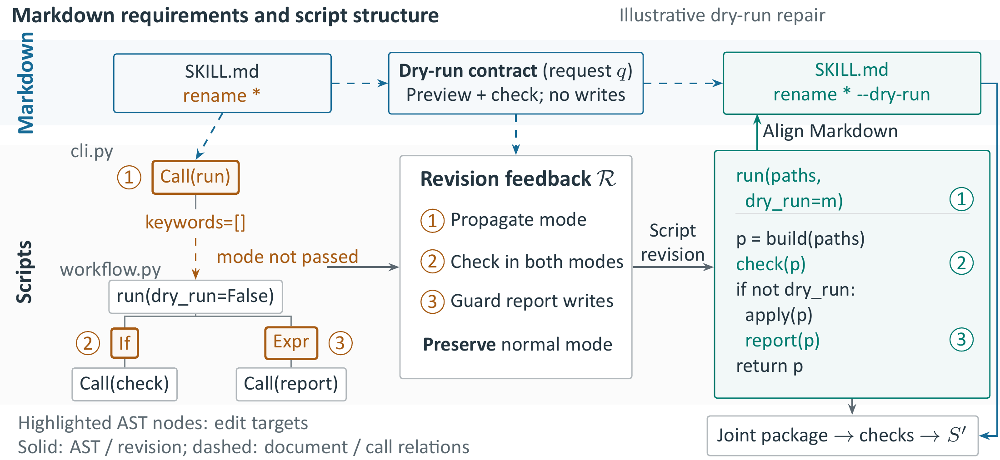
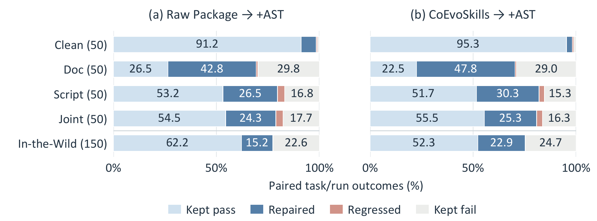
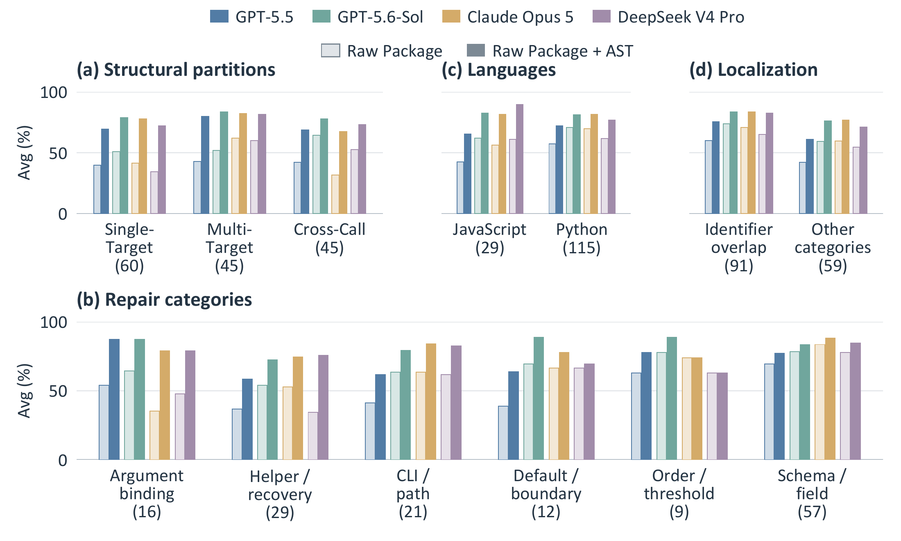

# SkillScriptBench

**Benchmarking Self-Evolution of Executable Agent Skill Packages Beyond Markdown**

[Paper](https://arxiv.org/abs/2610.04008) · [Dataset](benchmark/README.md) · [Evaluation](docs/evaluation.md) · [Example](examples/README.md)

SkillScriptBench evaluates repair and preservation of executable agent skill packages containing Markdown instructions and scripts. This repository contains the benchmark and evaluation tools.

## Dataset

| Track | Tasks | Purpose |
| --- | ---: | --- |
| In-the-Wild Repair | 150 | Script repair in 100 repository-sourced packages |
| Controlled Repair | 200 | 50 packages in Clean, Doc, Script, and Joint states |

Each task provides a `REQUEST.md` and a complete input `package/`. Your method returns a revised package for evaluation.

[](docs/assets/figures/figure2_application_coverage.pdf)

*In-the-Wild Repair spans six application domains and 24 uses.*

## AST-Guided Skill Revision

AST-Guided Skill Revision links maintenance requirements to script structure and calling relationships to identify repair targets and behavior to preserve. It guides localized script edits, then aligns `SKILL.md` with the revised implementation.

[](docs/assets/figures/figure3_ast_guided_revision.pdf)

*A dry-run example: numbered issues map through revision feedback to script edits and an aligned `SKILL.md` command.*

Across four LLM backbones, this additional revision stage raises mean repair success on the 300 faulty-package tasks from **54.8% to 76.7%** for Raw Package and from **48.8% to 76.5%** for CoEvoSkills.

<p align="center">
  <a href="docs/assets/figures/figure4_repair_and_preservation.pdf">
    
  </a>
</p>

*AST-guided revision corrects failures while preserving successful behavior. Outcomes are pooled across four backbones and three runs.*

<p align="center">
  <a href="docs/assets/figures/figure5_task_characteristics.pdf">
    
  </a>
</p>

*Repair success across structural partitions, repair categories, languages, and request localization. Light/dark bars compare Raw Package and Raw Package + AST; parentheses give task counts.*

## Load a task

Use Python 3.12+ from the repository root:

```bash
python -m pip install -e .
skillscriptbench list --split all
skillscriptbench materialize d16-matlab-multiroute --output runs/example
```

The workspace contains only the request and package. The `main_results` subset selects 300 repair tasks; `clean` selects 50 preservation tasks. See the [dataset guide](benchmark/README.md) for the Python API and metadata.

## Try the evaluator

On Linux x86-64 with Python 3.12, Docker, and authenticated GitHub CLI access:

```bash
python -m pip install -e '.[evaluation]'
python scripts/fetch_assets.py --demo --load
python examples/check_installation.py --bundle assets/evaluator \
  --output runs/installation-example
```

The example uses two original benchmark inputs: the Clean package should **pass**,
and its script-fault counterpart should **fail**. It downloads only their two
runtime images and the evaluator (about 1.19 GB combined), rather than the
complete runtime archive.
See the [example guide](examples/README.md).

## Evaluate your packages

Select the tasks whose environments you need, then score your revised packages:

```bash
python scripts/fetch_assets.py --task TASK_ID --load
python evaluate.py --bundle assets/evaluator --task TASK_ID \
  --candidate /path/to/revised/package --output runs/evaluation
```

A task succeeds when both behavioral and documentation-driven checks pass. The command produces `scores.csv`, `summary.json`, and per-task logs. For multiple packages, supply a [candidate manifest](docs/evaluation.md#batch-evaluation):

```bash
python evaluate.py --bundle assets/evaluator --manifest candidates.json \
  --output runs/batch --workers 2
```

Three runs per task produce Avg, P@3, and Hit³, with Clean preservation reported separately from repair.

The downloader reuses installed images and verified files. Tasks without an
independent image asset use the full runtime archive; `--plan` shows the required
download before execution. See [setup and task inspection](docs/evaluation.md).

## Contents

```text
benchmark/   350 task inputs, metadata, source attribution, and license notices
ssbench/     Task loader and scoring CLI
evaluate.py  Single-task and batch evaluation
docs/        Evaluation guide and paper figures
scripts/     Runtime asset loader
examples/    Two-task installation example
distribution/ Pinned download catalog
tests/       Loader and evaluator tests
```

The large evaluator and runtime assets are distributed separately from Git. They contain the task-specific checks, fixtures, and pinned environments required for scoring.

## Citation and attribution

```bibtex
@misc{liu2026skillscriptbench,
  title = {SkillScriptBench: Benchmarking Self-Evolution of Executable Agent Skill Packages Beyond Markdown},
  author = {Liu, Yuxuan and Li, Haoran and Zhang, Yuhao and Guo, Jiahe and Luo, Hongyu and Hu, Wenbin and Jing, Huihao and Chung, Kawai and Chen, Junle and Fan, Changxuan and Zong, Qing and Xie, Lingyun and Song, Yangqiu},
  year = {2026},
  eprint = {2610.04008},
  archivePrefix = {arXiv}
}
```

Third-party files retain their original terms; see [NOTICE](NOTICE) and [source attribution](benchmark/SOURCES.md). A project-level license has not yet been selected. Execute task code in isolated environments without credentials; see [security guidance](SECURITY.md).
