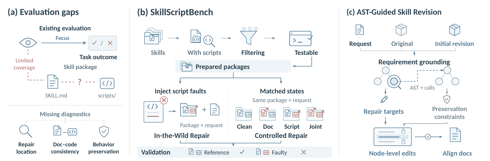

# SkillScriptBench

### Benchmarking Self-Evolution of Executable Agent Skill Packages Beyond Markdown

[Paper](https://arxiv.org/abs/2610.04008) · [Benchmark](benchmark/README.md) · [Running](docs/running.md) · [Evaluation](docs/evaluation.md) · [Method](docs/method.md)

SkillScriptBench evaluates whether methods can jointly repair an agent skill's Markdown and scripts while preserving correct behavior. **AST-Guided Skill Revision** combines LLM requirement discovery, AST-bound script revision, and Markdown alignment.



## Benchmark

| Track | Tasks | Purpose |
| --- | ---: | --- |
| In-the-Wild Repair | 150 | Script repair in 100 repository-sourced packages |
| Controlled Repair | 200 | 50 packages in Clean, Doc, Script, and Joint states |

All 350 requests and input packages are included. `main_results` selects the 300 repair tasks; `clean` selects the 50 preservation tasks. See the [data guide](benchmark/README.md) for task structure and source attribution.

## Installation and task loading

Use Python 3.12+ from the repository root:

```bash
python -m pip install -e .
skillscriptbench list --split all
skillscriptbench show d16-matlab-multiroute
skillscriptbench materialize d16-matlab-multiroute --output runs/example
```

## Run AST-Guided Skill Revision

JavaScript parsing requires Node.js 22.18+ within 22.x, or 24.11+.

```bash
python -m pip install -e '.[revision]'
npm ci --prefix code/runtime/ASTSkill/skillscriptbench/js_parser

skillscriptbench revise prepare \
  --parent runs/example/package \
  --proposal /path/to/baseline-generated/package \
  --request runs/example/REQUEST.md \
  --model YOUR_EXACT_MODEL_ID \
  --output runs/revision
```

`prepare` creates a run without calling a model. Follow the [running guide](docs/running.md) to execute it with your provider; [prompt templates](code/prompts/) and the [callback API](docs/method.md#public-api) are included.

## Evaluate a package

The scoring CLI uses separate evaluator and Docker runtime assets. Follow the [evaluation guide](docs/evaluation.md) for installation and scoring commands. These large assets are not included in the Git checkout.

## Main results

Four-model mean on the 300 repair tasks; values are percentages.

| Method | Avg ↑ | Hit³ ↑ |
| --- | ---: | ---: |
| Markdown-only | 4.5 | 3.0 |
| Raw Package | 54.8 | 44.2 |
| Raw Package + AST | **76.7** | 65.0 |
| CoEvoSkills | 48.8 | 34.1 |
| CoEvoSkills + AST | 76.5 | **65.7** |

Avg averages success over three runs; Hit³ requires all three to succeed. Reproduce Table 2 from the included per-run outcomes:

```bash
python results/reproduce_table2.py
```

[Result files and metrics →](docs/results.md)

## Citation

```bibtex
@misc{liu2026skillscriptbench,
  title = {SkillScriptBench: Benchmarking Self-Evolution of Executable Agent Skill Packages Beyond Markdown},
  author = {Liu, Yuxuan and Li, Haoran and Zhang, Yuhao and Guo, Jiahe and Luo, Hongyu and Hu, Wenbin and Jing, Huihao and Chung, Kawai and Chen, Junle and Fan, Changxuan and Zong, Qing and Xie, Lingyun and Song, Yangqiu},
  year = {2026},
  eprint = {2610.04008},
  archivePrefix = {arXiv},
  url = {https://arxiv.org/abs/2610.04008}
}
```

A project-level license has not yet been selected. Third-party files retain their original terms; see [NOTICE](NOTICE) and the [source inventory](benchmark/SOURCES.json). Run task code in isolated environments without credentials; see [security guidance](SECURITY.md).
