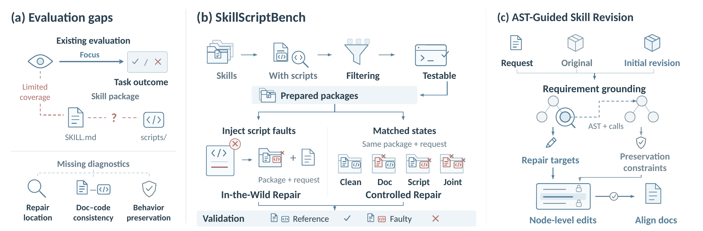

# Paper figures

Main-text figures from [SkillScriptBench](https://arxiv.org/abs/2610.04008). Each preview links to its vector PDF.

[Overview](#figure-1-overview) · [Application coverage](#figure-2-application-coverage) · [Method](#figure-3-ast-guided-skill-revision) · [Repair and preservation](#figure-4-repair-and-preservation) · [Task characteristics](#figure-5-task-characteristics)

## Figure 1. Overview

Overview of SkillScriptBench and AST-Guided Skill Revision: evaluation gaps, benchmark construction, and coordinated documentation–script revision.

## Figure 2. Application coverage

Application coverage of In-the-Wild Repair. Inner and outer rings show six application domains and 24 uses, respectively. Uses are listed clockwise within each domain.

## Figure 3. AST-Guided Skill Revision

AST-Guided Skill Revision on a dry-run example. Numbered issues (1–3) map through revision feedback to corresponding script edits, enabling preview generation and conflict checking without renaming files or writing reports in dry-run mode. The `SKILL.md` command is updated with `--dry-run` to match the repaired implementation.

## Figure 4. Repair and preservation

AST-guided revision improves repair and preservation. Paired outcomes for (a) Raw Package and (b) CoEvoSkills before and after AST-guided revision, pooled across four backbones and three runs. Parentheses indicate task counts.

## Figure 5. Task characteristics

Revision gains vary across task characteristics. Panel (a) uses faulty-package tasks from Controlled Repair; panels (b–d) use In-the-Wild. Light/dark bars show Raw Package/Raw Package + AST Avg over three runs for each model. Parentheses give task counts. Complete repair-category results appear in Appendix Figure 7 of the paper.

[Back to the repository](../README.md)
